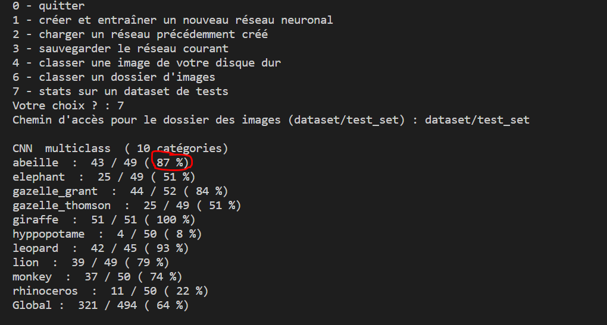
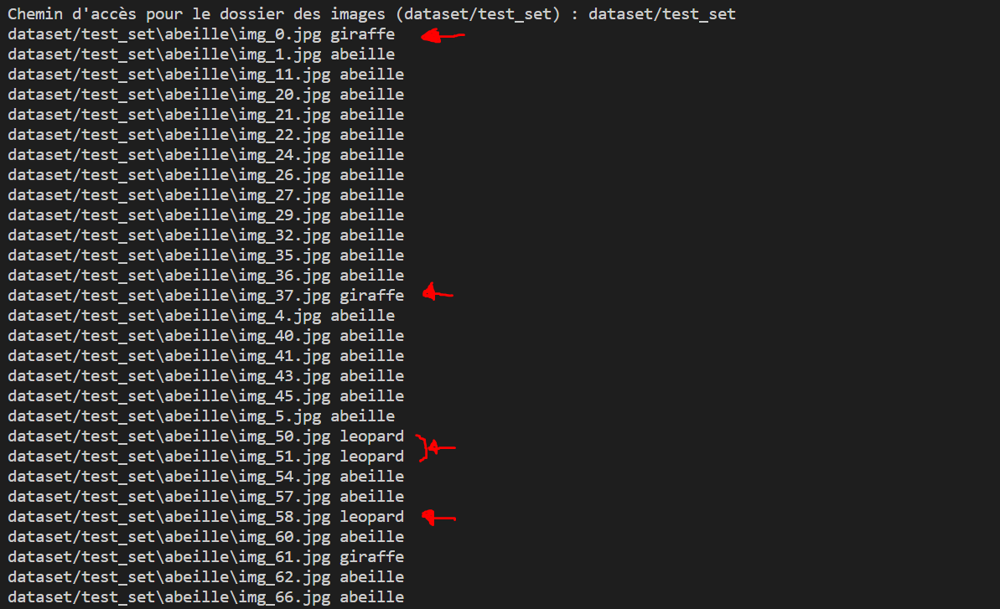

# *1- Essais*

## *1.1- Domaine*

Nous avons choisi pour nos essais d'intelligence artificielle de tester la reconnaince des animaux. 

## *1.2- Catégories*

Nous avons fait le choix de tester les catégories suivantes : abeilles, éléphant, gazelle, giraffe, hyppopotame, léopard, lion, singe et rhinocéros.


## *1.3- Remarques sur la constitution du corpus d'apprentissage*

La construction d'un corpus d'apprentissage d'images représentative des futures images à reconnaitre se fait en plusieures étapes. 
Tout d'abord, nous avons utilisé le scrypte `image_search_scraper.py` pour télécharger d'internet 100 images de chacune des catégories que nous avons choisies. Pour cela nous avons modifié la ligne 213 pour y écrire notre propre requête : `query = ["tarte au citron", "tarte à la fraise"]`. Ces photos sont chargées dans notre fichier et dans un dossier intitulé "dataset". 
Nous avons ensuite passé en revue chaques photos. En effet, les photos téléchargées sont les résultats d'une recherche d'internet, ainsi toutes les photos ne sont pas forcément représentatives de la catégories, il faut donc les supprimer manuellemnet. 
Nous avons utilisé le script `dataset_splitter.py`. Ce dernier a récupéré les photos contenues dans le fichier "raw_set" et les a réparties aléatoirement dans deux sous-fichiers. Le premier sous-fichier contient 80% des photos du fichier innitial, il s'intitule "training-set" et il sevira à l'apprentissage du réseau neuronal. Le deuxième sous-fichier contient les 20% de photos restantes, il s'intitule "test_set" et servira à tester les réseau neuronal entrainé. 


## *1.4- Remarques sur la création d'un réseau neuronal son utilisation et sa performance*

Le scirpt `simple_cnn_menu.py` est l'algorithme qui permet la création et l’apprentissage d’un nouveau réseau neuronal à partir d’un corpus d’apprentissage. On a ensuite, entre autre, la possibilité d’enregistrer le réseau construit dans un fichier, puis de l'utiliser pour déterminer la catégorie d’une image test.

Concrètement ce qu'on fait avec ce programme c'est lui apprendre à reconnaître des images (via son "système neuronal"). Il balaie les images de façon aléatoire, puis s'adapte pour reconnaître des images de catégories différentes en les triant. A la suite de cet apprentissage on lui fait faire des tests statistiques :  à savoir, on lui donne de nouvelles images pour qu'il essaie à nouveau de les reconnaître.
Dans l'exemple ci-dessous, nous verrons via les pourcentages combien d'images le programme parvient à bien identifier.On lui demande donc ce qu'il a reconnu !

    
 **Reconnaissance des images**

Nous avons lancé un premier apprentissage à "5 passes" avec le corpus d’apprentissage pour que le réseau neuronal apprenne à différencier les images des catégories du domaine choisi. Nous avons observé que plus on augmente le nombre de passes, plus la création du réseau neuronal prends du temps, mais plus la reconnaissance est précise. Le réseau neuronal devient cependant moins apte à reconnaitre d'autres images. 

Le hasard correspondant à une chance sur deux soit 50%, pour que notre proggrame d'intellignece artificielle soit intéressant, son taux de réussite doit être supérieur à 50% et idéalement tendre vers 100%. 

La figure ci-dessous est une capture d'écran montrant que le programme a reconnu *87%* d'images d'abeilles.
Ainsi, 87% de reconnaissance sur une diziane de catégories est plutôt bien. En effet, plus on ferait tourner ce programme plus l'analyse serait précise.

```{r echo=F, out.width='50%', fig.align='center'}

```

Cette deuxième image reflète ce que le programme a reconnu. On remarque donc que la première image a mal été identifié tout comme l'image n°37, n°50,51,58 puis d'autres encore. Les autres images sont correctement reconnues. Cette mauvaise identification peut s'expliquer par des écritures sur l'image, des pixels un peu sombres, des couleurs pas assez marquantes...

```{r echo=F, out.width='50%', fig.align='center'}

```


# **2- Etude de réseaux neuronaux à partir de graphique**

Il nous a été demandé d'analyser un jeu de données sur de la reconnaissance d'images. Ce tableau de 9 variables reprend les différents facteurs qui vont nous permettre d'obtenir un pourcentage de réussite au test de reconnaissance par la machine. Un pourcentage élevé signifie que le test de reconnaissance est réussi en fonction de ce qui est cherché et ce qui est attendu. 
Afin d'expliquer de quoi dépend le pourcentage de réussite, nous avons décidé de tester séparément y en fonction de x, x étant chaque facteur : Nombre de neurones / Nombre d'images à l'entrainement / Nombre de passes.
Si l'on prend chaque facteur individuellement, nous souhaiterons obtenir logiquement une régression linéaire positive. En effet, on peut se dire que plus le nombre de neurones est important, mieux sera la réussite. 
Nous obtenons donc les graphiques suivants :

```{r datatemp1, echo = FALSE,eval=TRUE}
library(ggplot2)

library("gridExtra")
graph <- read.csv("../IsaraS8OpenDeepLearning/models.csv",
                sep=",",
                col.names = c(rep("numeric",2), "character", rep("numeric",2), "character", rep("numeric",2)),
                na.strings="NA")
names(graph) <- c("Nbr_classes", "Nbr_neurones", "Dataset_entrainement", "Nbr_images_entrainement", "Nbr_passes", "Dataset_test", "Nbr_images_test","Pourcentage_reussite")
graph$Factor<-paste(graph$Nbr_neurones, graph$Dataset_entrainement)
#On cocatene : Nombres de neuronnes et data set entrainement 
graph$Nombre_neurones_et_images<-paste(graph$Nbr_neurones, graph$Dataset_entrainement)
```


```{r fig.width=7, fig.height=4, echo=FALSE}


graph1 <- qplot(Nbr_neurones, Pourcentage_reussite, data = graph, geom = "auto", 
      xlim = c(0,550), 
      ylim = c(0,75), 
      main = "% Réussite en fonction \n du nombre de neurones",
      xlab = "Nombre de neurones",
      ylab = "Pourcentage de reussite au test") + theme(
   plot.title = element_text(color="#990000", size=10, face="bold"),  
   axis.title.x = element_text(color="#333000", size=9),
   axis.title.y = element_text(color="#333000", size=10)) + geom_point(color='#990000')


#2 Pourcentage de réussite en fonction du nombre d'image à l'entrainement 

graph2<- qplot(Nbr_images_entrainement, Pourcentage_reussite, data = graph, geom = "auto", 
      xlim = c(0,2000), 
      ylim = c(0,75), 
      main = "% Réussite en fonction \n du nombre images à l'entrainement",
      xlab = "Nombre d'images à l'entrainement",
      ylab = "Pourcentage de reussite au test")+ theme(
   plot.title = element_text(color="#330066", size=10, face="bold"),
   axis.title.x = element_text(color="#333000", size=9),
   axis.title.y = element_text(color="#333000", size=10)) + geom_point(color='#330066')

#3 Pourcentage de réussite en fonction du nombre de passe

graph3 <- qplot(Nbr_passes, Pourcentage_reussite, data = graph, geom = "auto", 
      xlim = c(0,70), 
      ylim = c(0,75), 
      main = "% Réussite en fonction \n du nombre de passes",
      xlab = "Nombre de passes",
      ylab = "Pourcentage de réussite au test") + theme(
   plot.title = element_text(color="#006600", size=10, face="bold"),
   axis.title.x = element_text(color="#333000", size=9),
   axis.title.y = element_text(color="#333000", size=10))+ geom_point(color='#006600')
```

```{r fig.width=10, fig.height=6, echo=FALSE}

#Combiner plusieurs graphiques sur la même page


grid.arrange(graph1,graph2,graph3, ncol=3)

png("Combiné.png", width = 1200, height = 500)
#Ce qu'on remarque c'est qu'il n'y a pas un modele parfait. Tous les facteurs interagisse entre eux  
# Pour faire interagir les trois facteurs : Neurones / Passes / Nbrs d'images --> on concatene
# Or on ne peut pas concatener : neurones et nbr d'image vu que ce sont deux numériques 
# Mais le dataset_entrainement correspond à un nombre d'image de l'entrainement 
# Catdog = 1589 images 
# Savane50 = 334 images
# Savane 100 = 693 images 
# On va donc pouvoir concatener un numérique et un non numérique pour expliquer les différents facteurs 


```

Ce qu'on peut remarquer en premier lieu, c'est qu'il n'y a aucune tendance qui se dégage dans les trois graphiques. Nous pouvons donc dire que le pourcentage de réussite n'est pas le résultat d'un facteur, mais qu'il s'agit bien d'une intéraction entre les trois facteurs étudiés. Il faut donc exprimer le pourcentage de réussite en fonction de ces 3 facteurs. 
Nous avons de choisi de générer un graphique qui permettrait de montrer l’influence de 3 facteurs différents sur le pourcentage de réussite. Ces trois facteurs sont les suivants : le nombre d’images à l’entrainement, le nombre de neurones et le nombre de passes.
Pour arriver à tous les représenter sur un même graphique, nous avons choisi de concaténer les colonnes nombre_de_neurones et dataset_entrainement afin de mettre en relation les facteurs nombre d’images à l’entrainement et nombre de neurones. On observe alors sur le graphique 4 courbes représentant les 4 combinaisons possibles de ces deux facteurs : 128 catdog, 128 savane100, 128 savane50, 512 savane100. Pour chacune d’elle on observe l’évolution du pourcentage de réussite en fonction du nombre de passes. 
 
	
	
```{r fig.width=7, fig.height=4, echo=FALSE}


#On peut faire le graphique pour voir l'interaction des paramètres 


qplot(Nbr_passes, Pourcentage_reussite, data = graph, color=Nombre_neurones_et_images, geom = c("point", "line"),  
      main = "Pourcentage de reussite en fonction du nombre de passes",
      xlab = "Nombre de passes",
      ylab = "Pourcentage de réussite au test") + theme(
   plot.title = element_text(color="#333333", size=16, face="bold"),
   axis.title.x = element_text(color="#333333", size=14),
   axis.title.y = element_text(color="#333333", size=14))

png("Pourcentage_de_reussite.png", width = 800, height = 600)
```

Nous pouvons observer que les réseaux neuronaux créés à partir du jeu de données catdog contenant 1 589 images et ayant 128 neurones ont un taux de réussite qui varie entre 63% et 72%. Ces réseaux neuronaux permettent d’obtenir de meilleurs pourcentages de réussite que les réseaux neuronaux entrainés avec les jeux de donnée Savane. Cela peut s’expliquer par le fait que le nombre d’images analysées est beaucoup plus important, mais aussi par le faible nombre de catégories à distinguer. Nous pouvons donc en déduire que pour entrainer un réseau neuronal à reconnaitre peu de catégories, il est plus intéressant d’utiliser un jeu de donnée contenant un nombre d’images plus important. 

Le jeu de données Savane50 contient 50% des images du jeu de données Savane100. On observe que les réseaux neuronaux entrainés avec le jeu de donnée Savane50 ont un pourcentage de réussite qui varie entre 60% et 51%. Ces résultats sont bien meilleurs que ceux des réseaux neuronaux entrainés avec le jeu de donnée Savane100 (pourcentage de réussite compris entre 6% et 10%). Nous pouvons en déduire que lorsqu’on veut entrainer un réseau neuronal à reconnaitre beaucoup de catégories, il est plus intéressant de l’entrainer avec un jeu de données comportant moins d’images. 

Nous remarquons également que le nombre de neurones ne permet pas forcément d’obtenir de meilleurs pourcentages. En effet, les réseaux contenant le plus de neurones (512) obtiennent des taux de réussite inférieurs à 10%.

Enfin, nous pouvons observer qu’augmenter le nombre de passes pour entrainer un réseau neuronal analysant peu de catégories lui permet d’être plus performant. 


# *3- Remarques sur le module*

Les points forts du  module que nous pouvons notés sont la prise en compte de la multitude de données que nous pouvons manipuler et finalement des fichiers, applications, objets (graphiques...) que nous pouvons créer.
Ensuite, la distance entre les collègues et les enseignants nous force à chercher par nous même afin de nous débloquer et perdre le moins de temps possible.

On notera alors que ce module nous force à faire preuve d'autonomie et **surtout** d'entraîde.

Les points faibles sont plus de l'ordre de la difficulté à comprendre le codage et la programmation, lorsqu'on est encore novice dans le domaine. En effet avoir un enseignement à distance rend toutes les choses plus compliquées. Enfin, les discussions sur plusieurs plateformes telles que le chat, la visio, les conversions...en même temps rend difficile la compréhension et le focus.
Toutefois la qualité de la visiocoférence était d'une grande qualité.


